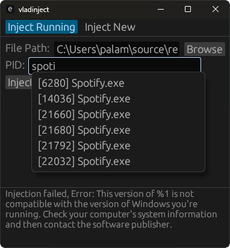

# vladinject - dll injector written in rust
supports injection to both native x64 and wow64 processes 
gui written using egui

 

Running injection is done via CreateRemoteThread 
New process injection is done via APC queue
